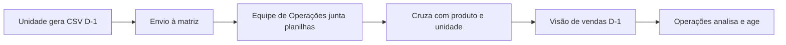
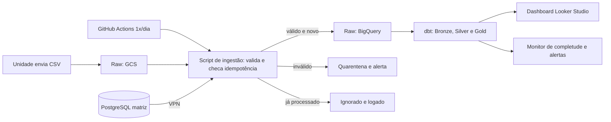
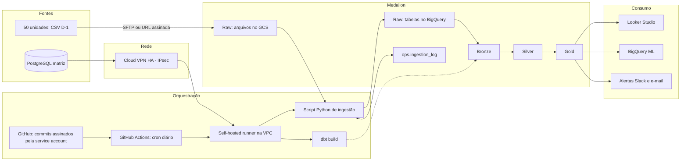

# Case Mr. Health: proposta de modernização do Data Warehouse

Stack: **GCP** (GCS + BigQuery) · **dbt** · **Git/GitHub** · orquestração via **GitHub Actions** agendada 1x ao dia · **arquitetura Medalion** (Raw / Bronze / Silver / Gold).

---

## 1. Mapeamento do processo atual (AS-IS)

Cada uma das ~50 unidades gera `pedido.csv` e `item_pedido.csv` à meia-noite (D-1). A equipe de Operações consolida tudo manualmente em planilhas e só então a visão de vendas chega à diretoria e aos gestores.

### Pontos problemáticos

| # | Ponto problemático | Impacto |
|---|---|---|
| 1 | Consolidação manual em planilhas | Erro humano, retrabalho, dependência de pessoas |
| 2 | Sem validação de schema, formato ou duplicidade | Datas, decimais e status inconsistentes |
| 3 | Sem controle de completude | Ninguém sabe se uma unidade deixou de enviar |
| 4 | Latência alta | O D-1 só existe após o trabalho manual |
| 5 | Produto/Unidade/Estado/País ficam no PostgreSQL | Cruzamento manual (PROCV) |
| 6 | `item_pedido` não possui `Id_Unidade` | Unidade só via join com `pedido` ou pelo nome do arquivo |
| 7 | Pedido "Pendente" muda de status depois | Versões conflitantes do mesmo pedido |
| 8 | Sem histórico, versionamento ou rastreabilidade | Sem auditoria nem base para modelos de estoque |
| 9 | Endereço de entrega em planilhas soltas | Risco de LGPD |
| 10 | Sem alertas ou recomendações | Gestão reativa |
| 11 | Reenvio do mesmo arquivo pela unidade | Vendas contadas em dobro |

---

## 2. Mapeamento do processo futuro (TO-BE)

**Fluxo diário (workflow agendado):**

1. As unidades enviam os CSVs para o bucket GCS da camada Raw (SFTP gerenciado, URL assinada ou `gcloud storage cp`).
2. O workflow do GitHub Actions dispara 1x ao dia, após a janela de envio (ex.: 06:00 BRT).
3. O job autentica no GCP via Workload Identity Federation (sem chave de service account no repositório).
4. O script de ingestão lista os arquivos novos, valida nome, schema, unidade e data, checa idempotência e carrega as tabelas Raw no BigQuery, sem alterar o conteúdo. Arquivos inválidos vão para quarentena.
5. O mesmo job, executando em um runner dentro da VPC, extrai as 4 tabelas do PostgreSQL da matriz pela **VPN** e grava na Raw.
6. O job roda `dbt build`: Bronze (nomes e tipos corrigidos), Silver (agregações) e Gold (tabelas para relatórios), com testes.
7. O monitor de completude confere se as 50 unidades enviaram e notifica Slack/e-mail sobre as faltantes e sobre falhas.
8. A área de Operações consome o dashboard e os alertas, sem montar planilha.

### Avaliação dos problemas

| Problema | Status | Como |
|---|---|---|
| 1, 4 | Resolvido | Automação ponta a ponta; D-1 disponível pela manhã |
| 2, 8 | Resolvido | Contrato de dados, testes dbt, Raw imutável, Git com commits assinados |
| 3 | Resolvido | Monitor de completude por unidade e dia |
| 5, 6 | Resolvido | Joins no dbt; `id_unidade` derivado do caminho do arquivo |
| 7 | Minimizado | Bronze incremental com MERGE em `(id_unidade, id_pedido)`, mantendo o último status |
| 9 | Minimizado | Policy tags/mascaramento no BigQuery e IAM por camada |
| 10 | Parcial | Alertas operacionais na fase 1; recomendação de estoque na fase 2 |
| 11 | Resolvido | Estratégia de idempotência (seção 6) |

---

## 3. Diagrama de arquitetura (GCP)

### Justificativas

- **GCS + BigQuery:** lake para arquivos e warehouse serverless para SQL e dbt, sem infraestrutura para administrar.
- **GitHub Actions agendado:** o repositório já existe por causa do dbt e do Git, então não há ferramenta nova para operar nem custo fixo de orquestrador. O cron diário atende o SLA de D-1, com `workflow_dispatch` para execução manual e reprocessamento.
- **Conexão com o PostgreSQL via VPN:** Cloud VPN (HA VPN, túnel IPsec) entre a rede da matriz e a VPC do projeto. O banco é acessado por IP privado, sem exposição à internet, com usuário somente leitura e credenciais no Secret Manager.
- **Self-hosted runner na VPC:** como os runners hospedados do GitHub não alcançam a VPN, o job que acessa o PostgreSQL (e, por simplicidade, todo o workflow de produção) roda em um runner próprio (VM no GCE) dentro da VPC, com service account de menor privilégio.
- **Autenticação no GCP:** Workload Identity Federation entre GitHub e GCP, restrita ao repositório e à branch `main`; segredos no Secret Manager.
- **Concorrência:** `concurrency` no workflow para impedir duas execuções simultâneas.
- **Trade-offs conhecidos:** o cron do Actions pode atrasar alguns minutos, e não há retry/backfill nativos. Por isso o pipeline precisa ser idempotente (seção 6) e ter alerta de falha. O runner próprio exige manutenção (patches, monitoramento) e deve ser tratado como componente de produção.
- **Transversal:** IAM por camada, Secret Manager, Cloud Logging/Monitoring e Terraform.

### Governança do Git: commits assinados pela service account

Todas as alterações no repositório são registradas com a assinatura de uma **service account de Git** (identidade de bot dedicada, ex.: `svc-mrhealth-git`).

- **Chave de assinatura:** par de chaves GPG (ou SSH) exclusivo da service account; a chave privada fica no Secret Manager/GitHub Secrets e a pública é cadastrada na conta do bot. Os commits aparecem como *Verified* no GitHub.
- **Fluxo:** pessoas abrem Pull Requests; após revisão e CI verde, o merge é executado pela service account (commit assinado). Commits automáticos dos workflows (ex.: atualização da documentação do dbt) também são assinados por ela.
- **Proteção da branch `main`:** exigir PR, revisão obrigatória, status checks e **commits assinados**; push direto bloqueado.
- **Rastreabilidade:** a autoria humana é preservada no PR (autor, revisores) e via `Co-authored-by` no commit, de modo que a assinatura da service account não apaga quem fez a mudança.
- **Rotação e revogação:** a chave tem rotina de rotação; em caso de comprometimento, é revogada sem afetar contas pessoais.

---

## 4. Camadas do datalake (arquitetura Medalion)

| Camada | Definição | Onde | Estrutura | Regras |
|---|---|---|---|---|
| **Raw** | Dado **como foi recebido** | GCS (arquivos) e BigQuery `raw_csv`, `raw_postgres` (tabelas) | Arquivos: `gs://raw/id_unidade=XX/dt=YYYY-MM-DD/arquivo.csv`. Tabelas espelho da origem (`pedido`, `item_pedido`, `produto`, `unidade`, `estado`, `pais`), nomes originais, tudo STRING, mais metadados `_ingestion_ts`, `_source_file`, `_file_hash`, `_file_version`, `_id_unidade`, `_batch_id` | Imutável e append-only, particionada por data de ingestão; nenhuma transformação; base de reprocessamento. Após o processamento o arquivo vai para `processed/` ou `rejected/` |
| **Bronze** | Dado com **nomenclatura e tipagem corrigidas** | BigQuery `bronze` (dbt) | `bronze_pedido`, `bronze_item_pedido`, `bronze_produto`, `bronze_unidade`, `bronze_estado`, `bronze_pais` | snake_case e nomes padronizados, tipos corretos (DATE, NUMERIC, INT64), padronização de status e tipo de pedido, mantém uma linha por chave de negócio (deduplicação e **MERGE incremental**); sem regras de negócio nem agregações |
| **Silver** | Dado com as **agregações necessárias** | BigQuery `silver` (dbt) | `silver_unidade` (unidade + estado + país), `silver_pedido_item` (pedido + itens + produto + unidade, no grão do item), `silver_vendas_dia_unidade_produto` (agregação base por dia, unidade e produto) | Joins entre entidades e agregações reutilizáveis; particionadas por `data_pedido` e clusterizadas por `id_unidade` |
| **Gold** | Tabelas com **valor agregado, prontas para relatórios** | BigQuery `gold` (dbt) | `gold_vendas_diarias` (unidade × dia × tipo de pedido), `gold_vendas_produto`, `gold_cancelamentos`, `gold_ticket_medio`, `gold_consumo_produto_unidade` (base para estoque), `gold_completude_unidades`, `gold_alertas` | Métricas de negócio prontas para BI, ML e alertas; nomes e granularidade pensados para o consumidor final |
| **Controle** | Apoio à ingestão | BigQuery `ops` | `ingestion_log`, `quarantine` | Registro de cada arquivo processado e dos registros rejeitados com o motivo |

**Qualidade (dbt):** `unique`, `not_null`, `relationships`, `accepted_values` (status, tipo) e teste singular (soma dos itens ≈ `vlr_pedido`).

---

## 5. Atividades do projeto (ordem de execução)

| # | Atividade | Descrição |
|---|---|---|
| 1 | Kickoff e levantamento | Workshop com os responsáveis de Operações e de TI: SLA, volumetria, KPIs, formato real dos CSVs, regras de status |
| 2 | Contrato de dados | Documentar schema, tipos, chaves e nomes de arquivo; definir como obter `id_unidade` em `item_pedido` |
| 3 | Setup GCP | Projeto, billing, IAM, service accounts, ambientes dev/prd, Secret Manager |
| 4 | Conectividade VPN | Cloud VPN HA entre a matriz e a VPC (túnel IPsec, rotas, firewall) com o time de rede da matriz |
| 5 | IaC (Terraform) | Provisionar buckets, datasets, VPN, VM do runner e Workload Identity Federation |
| 6 | Repositório Git e governança | Estrutura do repo, branching, PR review, service account de Git com chave de assinatura, branch protection exigindo commits assinados |
| 7 | Self-hosted runner | VM na VPC, hardening, registro no GitHub, service account de menor privilégio |
| 8 | Canal de envio das unidades | Implantar SFTP ou URL assinada e orientar as unidades, incluindo a convenção de nomes |
| 9 | Bucket GCS da camada Raw | Estrutura por unidade/data, pastas `processed/` e `rejected/`, lifecycle |
| 10 | Datasets BigQuery | raw_csv, raw_postgres, bronze, silver, gold, ops, com permissões por camada |
| 11 | Tabelas de controle | `ops.ingestion_log` e `ops.quarantine` |
| 12 | Script de ingestão dos CSVs | Python: listar arquivos, validar schema/nome, calcular hash, checar idempotência, carregar na Raw sem transformar, mover o arquivo |
| 13 | Script de extração do PostgreSQL | Usuário read-only, acesso via VPN, cópia diária das 4 tabelas para a Raw com snapshot datado |
| 14 | Projeto dbt | Configuração, `sources` apontando para a Raw com freshness, targets dev/prd |
| 15 | Modelos Bronze | Renomeação, tipagem, padronização de domínios, deduplicação e MERGE incremental das 6 fontes |
| 16 | Modelos Silver | Enriquecimento de unidade (estado e país), pedido com itens e produto, agregação base por dia/unidade/produto |
| 17 | Modelos Gold | Tabelas de vendas, cancelamentos, ticket médio, consumo por unidade, completude e alertas |
| 18 | Testes de qualidade | Testes genéricos e singulares em cada camada; falha bloqueia a publicação |
| 19 | Workflow de produção (GitHub Actions) | Cron diário + `workflow_dispatch`, `concurrency`, autenticação via WIF, execução de ingestão, extração e `dbt build` no self-hosted runner |
| 20 | Workflow de CI | Em PR: lint + `dbt build` em dev + verificação de commits assinados; merge e deploy pela service account |
| 21 | Monitoramento e alertas | Completude por unidade, falha do workflow, freshness, saúde da VPN/runner e arquivos em quarentena, via Slack/e-mail |
| 22 | Segurança e LGPD | Policy tags/mascaramento de endereço, revisão de IAM, rotação de chaves |
| 23 | Testes de idempotência | Reenvio do mesmo arquivo, versão corrigida, reexecução do workflow e backfill |
| 24 | Carga histórica | Backfill das planilhas e arquivos existentes na Raw e reprocessamento das demais camadas |
| 25 | Dashboard | Painel D-1 no Looker Studio sobre a Gold, substituindo a planilha |
| 26 | Paralelo e UAT | Comparar planilha × DW por 1–2 semanas, com validação dos responsáveis de Operações |
| 27 | Documentação e treinamento | dbt docs, runbook, capacitação do time |
| 28 | Go-live e hypercare | Desligar o processo manual e acompanhar de perto |
| 29 | Fase 2: inteligência | Alertas de ruptura e anomalias; previsão de demanda e estoque (BigQuery ML ou Vertex AI) |

---

## 6. Estratégia de idempotência (arquivo enviado mais de uma vez)

**Objetivo:** processar o mesmo arquivo 1 ou N vezes e chegar sempre ao mesmo resultado, sem duplicar vendas. A proteção é feita em camadas: se uma falhar, a seguinte contém o problema.

### 6.1 Nível de arquivo (porta de entrada)

Cada arquivo recebe uma identidade: `id_unidade` + tipo + data de referência (do caminho) + **hash SHA-256 do conteúdo**. O script consulta `ops.ingestion_log` antes de carregar:

| Situação | Detecção | Ação |
|---|---|---|
| Mesmo arquivo reenviado (mesmo hash) | Hash já existe com status `LOADED` | **Ignora**, registra `SKIPPED_DUPLICATE` e move para `processed/duplicates/` |
| Arquivo corrigido (mesmo `unidade+tipo+data`, hash diferente) | Chave lógica existe com outro hash | Trata como **nova versão**: carrega com `_file_version` incrementado; a Bronze considera a mais recente |
| Execução anterior falhou no meio | Registro `STARTED` sem `LOADED` | **Reprocessa** o arquivo do zero (a carga é atômica, ver 6.2) |
| Arquivo malformado | Falha de validação | `quarantine` + alerta; não entra na Raw de tabelas |

`ops.ingestion_log` guarda: `file_path`, `file_hash`, `id_unidade`, `tipo`, `data_ref`, `file_version`, `row_count`, `status`, `batch_id`, `processed_at`.

### 6.2 Carga na Raw

- Cada arquivo é carregado por um **load job com `job_id` determinístico** derivado do hash (`load_{tipo}_{id_unidade}_{data_ref}_{hash8}`). Reexecutar o mesmo job ID não duplica: o BigQuery rejeita o ID repetido.
- Cada arquivo é gravado como **uma única operação atômica** (tudo ou nada), e o log só vai para `LOADED` depois do sucesso.
- A Raw continua **append-only**, mas toda linha carrega `_file_hash`, `_source_file` e `_ingestion_ts`. Se algo escapar da porta de entrada, o duplicado fica identificável, e não escondido.

### 6.3 Nível de registro (Bronze, Silver e Gold)

- **Bronze:** deduplicação com `ROW_NUMBER() OVER (PARTITION BY id_unidade, id_pedido ORDER BY _file_version DESC, _ingestion_ts DESC) = 1`, mantendo apenas o registro mais recente de cada pedido. Para `item_pedido`, a chave é `(id_unidade, id_pedido, id_item_pedido)`. A gravação usa **`MERGE` (estratégia `merge` do dbt)** na chave de negócio: rodar 1 ou 10 vezes dá o mesmo resultado. Isso também resolve a mudança de status "Pendente → Finalizado/Cancelado".
- **Regra de precedência de status:** o registro de maior `_file_version`/`_ingestion_ts` vence, evitando que um reenvio antigo sobrescreva um status mais novo.
- **Silver e Gold:** derivadas da Bronze de forma determinística (agregações recalculadas por partição de `data_pedido`), portanto também seguras para reexecução e sem acumular duplicidade.

### 6.4 Tabelas do PostgreSQL

Cópia completa por execução, gravada na partição do dia (`snapshot_date`) com **sobrescrita da partição** (`WRITE_TRUNCATE`). Reexecutar no mesmo dia substitui o snapshot, sem acumular duplicatas.

### 6.5 Nível de orquestração (GitHub Actions)

- `concurrency` no workflow: uma execução por vez, evitando corrida entre duas execuções.
- Todo passo é seguro para reexecução (itens acima), então `Re-run jobs` ou `workflow_dispatch` com `data_ref` (backfill) é sempre permitido.
- **Reprocessamento controlado:** parâmetro `force_reprocess` ignora o log para uma unidade/data específica; a idempotência na Bronze garante que o resultado final não duplique.

### 6.6 Testes e observabilidade

- Teste dbt `unique` em `(id_unidade, id_pedido)` e `(id_unidade, id_pedido, id_item_pedido)` nas tabelas Bronze: se falhar, o deploy para.
- Teste de reconciliação: contagem de linhas do arquivo (`row_count` no log) × Raw carregada, e Raw × Bronze por unidade/dia.
- Métrica no alerta diário: número de arquivos `SKIPPED_DUPLICATE`, nova versão e quarentena por unidade, para a área de Operações cobrar quem reenvia com frequência.

---

## Premissas

- A chave do pedido é composta (`id_unidade`, `id_pedido`).
- `item_pedido` não traz unidade; ela é derivada do caminho do arquivo.
- O status do pedido pode mudar entre envios diários.
- As unidades enviam os arquivos até antes da execução diária do workflow; arquivos tardios são processados na execução seguinte.
- A matriz disponibiliza um endpoint de VPN (ou equipamento compatível) e o time de rede participa da configuração do túnel.
